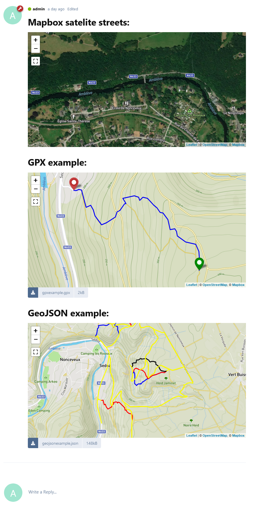
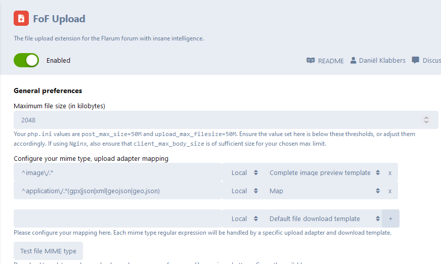
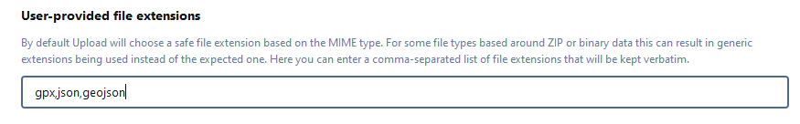

# Flarum Map extension

[](https://github.com/FriendsOfFlarum/upload/blob/master/LICENSE.md) [](https://packagist.org/packages/jeromegillard/map) [](https://packagist.org/packages/jeromegillard/map)

A [Flarum](http://flarum.org) extension.  
Display a map in flarum in those ways:
 - insert a BBCode in a post
 - upload a `.gpx` file to display it on a map and a download link
 - upload a `GeoJSON` file (`.geojson` of `.json`) display it on a map and a download link

   
The post above was written like this:  
```
# Mapbox satelite streets:
[map provider=mapbox style=mapbox/satellite-streets-v11 zoom=15]Nonceveux, Liège, Belgium[/map]

# GPX example:
[upl-file uuid=e89405b4-7c99-4af6-9fb3-8bd80df9ea64 size=2kB url=http://localhost/assets/files/2022-10-31/1667250318-401743-gpxexample.gpx]gpxexample.gpx[/upl-file]

# GeoJSON example:
[upl-file uuid=022d8589-8c9c-4e63-b0ad-1942b5a4b480 size=133kB url=http://localhost/assets/files/2022-10-11/1665509211-565647-trail-center-ambleve.geojson]trail-center-ambleve.geojson[/upl-file]
```
There's an icon to help you insert a map in your post:  


 ## Supported tile layers
 | Provider | Style | Tiles type | Description |
 | -------- | ----- | ---------- | ----------- |
 |  MapTiler | `basic-v2` | Vectors | [Basic (basic-v2)](https://cloud.maptiler.com/maps/basic-v2/) |
 |  MapTiler | `basic-4326` | Vectors | [Basic EPSG:4326 (basic-4326)](https://cloud.maptiler.com/maps/basic-4326/) |
 |  MapTiler | `bright-v2` | Vectors | [Bright (bright-v2)](https://cloud.maptiler.com/maps/bright-v2/) |
 |  MapTiler | `openstreetmap` | Vectors | [OpenStreetMap (openstreetmap)](https://cloud.maptiler.com/maps/openstreetmap/) |
 |  MapTiler | `outdoor` | Vectors | [Outdoor (outdoor)](https://cloud.maptiler.com/maps/outdoor/) |
 |  MapTiler | `pastel` | Vectors | [Pasterl (pastel)](https://cloud.maptiler.com/maps/pastel/) |
 |  MapTiler | `hybrid` | Vectors | [Satelite hybrid (hybrid)](https://cloud.maptiler.com/maps/hybrid/) |
 |  MapTiler | `streets-v2` | Vectors | [Street (streets-v2)](https://cloud.maptiler.com/maps/streets-v2/) |
 |  MapTiler | `toner` | Vectors | [Toner (toner)](https://cloud.maptiler.com/maps/toner/) |
 |  MapTiler | `topo` | Vectors | [Topo (topo)](https://cloud.maptiler.com/maps/topo/) |
 |  MapTiler | `topographique` | Vectors | [Topographique (topographique)](https://cloud.maptiler.com/maps/topographique/) |
 |  MapTiler | `voyager` | Vectors | [Voyager (voyager)](https://cloud.maptiler.com/maps/voyager/) |
 |  MapTiler | `winter` | Vectors | [Winter (winter)](https://cloud.maptiler.com/maps/winter/) |
 |  OpenStreetMap | | Rasters | [OpenStreetMap](https://www.openstreetmap.org) | 
 |  MapBox | `mapbox/streets-v11` | Vectors | [Streets (mapbox/streets-v11)](https://www.mapbox.com/maps/streets) |
 |  MapBox | `mapbox/outdoors-v11` | Vectors | [Outdoors (mapbox/outdoors-v11)](https://www.mapbox.com/maps/outdoors) |
 |  MapBox | `mapbox/light-v10` | Vectors | [Light (mapbox/light-v10)](https://www.mapbox.com/maps/light) |
 |  MapBox | `mapbox/dark-v10` | Vectors | [Dark (mapbox/dark-v10)](https://www.mapbox.com/maps/dark) |
 |  MapBox | `mapbox/satellite-v9` | Vectors | [Satelite (mapbox/satellite-v9)](https://www.mapbox.com/maps/satellite) |
 |  MapBox | `mapbox/satellite-streets-v11` | Vectors | [Satelite streets (mapbox/satellite-streets-v11)](https://docs.mapbox.com/help/getting-started/satellite-imagery/) |
 |  MapBox | `mapbox/navigation-day-v1` | Vectors | [Navigation day (mapbox/navigation-day-v1)](https://api.mapbox.com/styles/v1/mapbox/navigation-day-v1.html?access_token=pk.eyJ1IjoiZXhhbXBsZXMiLCJhIjoiY2p0MG01MXRqMW45cjQzb2R6b2ptc3J4MSJ9.zA2W0IkI0c6KaAhJfk9bWg#13/40.41695/-3.70192) |
 |  MapBox | `mapbox/navigation-night-v1` | Vectors | [Navigation night (mapbox/navigation-night-v1)](https://api.mapbox.com/styles/v1/mapbox/navigation-night-v1.html?access_token=pk.eyJ1IjoiZXhhbXBsZXMiLCJhIjoiY2p0MG01MXRqMW45cjQzb2R6b2ptc3J4MSJ9.zA2W0IkI0c6KaAhJfk9bWg#13/40.41695/-3.70192) |
 |  ThunderForest | `cycle` | Rasters | [cycle](https://www.thunderforest.com/maps/opencyclemap/) |
 |  ThunderForest | `transport` | Rasters | [transport](https://www.thunderforest.com/maps/transport/) |
 |  ThunderForest | `landscape` | Rasters | [landscape](https://www.thunderforest.com/maps/landscape/) |
 |  ThunderForest | `outdoors` | Rasters | [outdoors](https://www.thunderforest.com/maps/outdoors/) |
 |  ThunderForest | `transport-dark` | Rasters | [transport-dark](https://www.thunderforest.com/maps/transport-dark/) |
 |  ThunderForest | `spinal-map` | Rasters | [spinal-map](https://www.thunderforest.com/maps/spinal-map/) |
 |  ThunderForest | `pioneer` | Rasters | [pioneer](https://www.thunderforest.com/maps/pioneer/) |
 |  ThunderForest | `mobile-atlas` | Rasters | [mobile-atlas](https://www.thunderforest.com/maps/mobile-atlas/) |
 |  ThunderForest | `neighbourhood` | Rasters | [neighbourhood](https://www.thunderforest.com/maps/neighbourhood/) |
 |  ThunderForest | `atlas` | Rasters | [atlas](https://www.thunderforest.com/maps/atlas/) |

## Installation

### Composer
Install with composer:

```sh
composer require jeromegillard/map:"*"
```

### Configure extensions
1. Enable the `FoF Uploads` extension.
2. Enable the `Map` extension.
3. Configure `FoF Uploads` to add the new GPX Template: 
  - Add `^application\/.*(gpx|json|xml|geojson|geo.json)` mime type upload adapter mapping.
  - Select `Map` as template.  
  
4. Then add `gpx,json,geojson` extensions to this list:  
  
5. Configure the `Map` extension (optional).


:warning: Don't forget to save your changes!

## Updating

```sh
composer update jeromegillard/map:"*"
php flarum migrate
php flarum cache:clear
```

## GeoJSON

FeatureCollection can be displayed.

As an example, to generate the GeoJSON file `assets/GeoJSON.example.json` to get a view of all trails of the [Amblève Trail Center](https://endurovtt.be), follow those steps:
```
# Go to https://overpass-turbo.eu/
# Input that query:
[out:json][timeout:25];
(
  relation(13959062);>>;
)->.a;
rel.a;
out body;
>;
out skel qt;

# Click export, as GeoJSON
```

## Development

I've prepared a all-in-one `docker-compose` file to get up and running to develop this Flarum extension easily.

### Prepare the environment
1. create the `flarum-dev.env.local` file. There's an example just nearby.
1. Spin the containers: `docker-compose up -d`
1. Enter the container: `docker exec -it -w /flarum/app flarum-dev /bin/sh`
1. Allow local packages sources: `composer config repositories.0 path "packages/*"`
1. Install the extension: `composer require jeromegillard/map *@dev`
1. Wait for the container to start. It might be long stuck on last log "[INFO] Setting folder permissions", just wait.
1. You can browse to `http://localhost` when logs shows "[INFO] End of startup script. Forum is starting."
1. To rebuild the front-end, outside the container, go to the `js` folder and do `npm install` then `npm run dev` (you'll need npm installed on your computer). 

## Links

- [Packagist](https://packagist.org/packages/jeromegillard/map)
- [GitHub](https://github.com/JeromeGillard/flarum-map)
- [Discuss](https://discuss.flarum.org/d/31732-map-extension-display-a-map-a-gpx-or-a-geojson-file-in-a-post)
